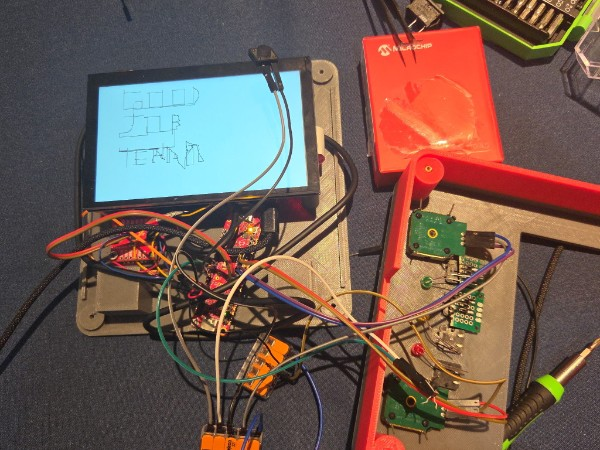
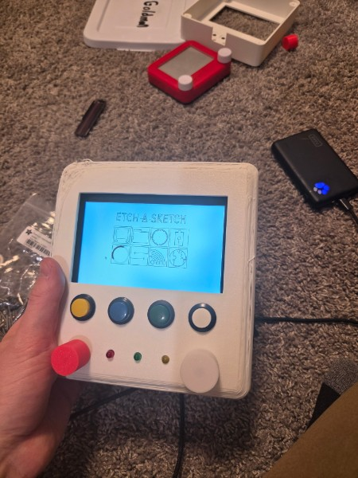

# Final Project

**Team Number:** 1

**Team Name:** Virtual Etch-a-Sketch

| Team Member Name | Email Address           |
| ---------------- | ----------------------- |
| Cameron Shaw     | cshaw1@seas.upenn.edu   |
| Clayton Hickey   | clhickey@seas.upenn.edu |
| Elan Goldman     | elangol@seas.upenn.edu  |

**GitHub Repository URL:** https://github.com/upenn-embedded/final-project-s26-t1

**GitHub Pages Website URL:** https://upenn-embedded.github.io/final-project-s26-t1/

## Final Project Proposal

### 1. Abstract

A device with a large tri-color e-ink display and knobs that will behave like an Etch-a-sketch, a mechanical 2D plotter toy that draws lines on its screen. Our project will reimagine the experience of using an etch-a-sketch while keeping the shake to erase functionality and classic 2 knobs for controlling the drawing cursor. The virtual etch-a-sketch will also have USB support, so that the knobs can be used to create drawings in apps like MS Paint or GIMP.

### 2. Motivation

The goal of this project is to expand what an etch-a-sketch can be while also reducing the durability issues that arise from the completely mechanical design of the original. The etch-a-sketch was originally designed to be a toy, while the virtual etch-a-sketch is targeted at artists who want a more consistent experience and more ways to augment the etch-a-sketch medium.

### 3. System Block Diagram

**Key**

Red: Regulated 5V

Yellow: Regulated 3.3V

### 4. Design Sketches

We will 3D print the entire enclosure and knobs for the etch-a-sketch. We will need a soldering iron for making electrical connections, as well as adding heat set inserts if needed.

### 5. Software Requirements Specification (SRS)

**5.2 Functionality**

| ID         | Description                                                                                                                                                                               |
| :--------- | :---------------------------------------------------------------------------------------------------------------------------------------------------------------------------------------- |
| **SRS-01** | The device shall display and persist user-drawn lines on the display. The cursor shall remain at the boundary of the screen if a user attempts to move it beyond the display coordinates. |
| **SRS-02** | The system shall update the cursor position based on simultaneous inputs from both knobs to do diagonal and curved line rendering.                                                        |
| **SRS-03** | The system shall respond to knob rotations with a display latency of less than 100 milliseconds to ensure real-time user interaction.                                                     |
| **SRS-04** | Upon USB connection to a host PC, the device shall enumerate as a Human Interface Device (HID) and map knob rotations to mouse-drag and click events.                                     |
| **SRS-05** | The system shall monitor the IMU and trigger a screen-clear event only when a continuous shaking motion is detected for a duration exceeding 1 second.                                    |
| **SRS-06** | The system shall change the active drawing color between black and red upon a toggle of the color mode switch, while maintaining the color of previously drawn lines.                     |

### 6. Hardware Requirements Specification (HRS)

**6.1 Definitions, Abbreviations**

- **USB:** Universal Serial Bus
- **PC:** Personal Computer
- **HID:** Human Interface Device
- **IMU:** Inertial Measurement Unit

**6.2 Functionality**

| ID         | Description                                                                                                                                                                |
| :--------- | :------------------------------------------------------------------------------------------------------------------------------------------------------------------------- |
| **HRS-01** | The device shall be powered by a 9V Alkaline battery and maintain operation for a minimum of 10 minutes under continuous use.                                              |
| **HRS-02** | The power management circuit shall maintain uninterrupted system operation during the transition of plugging or unplugging a USB-C cable.                                  |
| **HRS-03** | A physical power switch shall be integrated to disconnect the battery from all downstream circuitry, resulting in zero current draw (excluding ambient battery discharge). |
| **HRS-04** | The device enclosure shall feature two knobs positioned at the bottom corners of the display to emulate a mechanical drawing toy.                                          |
| **HRS-05** | The rotary encoders used for knobs shall be non-detented to provide smooth, continuous rotation without tactile clicks or bumps.                                           |
| **HRS-06** | The device chassis and internal component mounting shall withstand shaking without loss of electrical connectivity or functional failure.                                  |

_Note: we used Gemini to format the requirements._

### 7. Bill of Materials (BOM)

https://docs.google.com/spreadsheets/d/18jHvc1XVHpzNt5ybeaLdjjYaHa1GXTPeQhFLGrUgIds/edit?usp=sharing

**AVR64DU32 Curiosity Nano**: This is the main MCU where we will run our bare metal C code. This MCU is responsible for user input, sending drawing commands to the E-Ink MCU, and interfacing with a connected laptop over USB. We chose this board over the Atmega328PB dev board because it has a USB 2.0 interface that we can use to have it act as a keyboard and/or mouse on the connected laptop.
**Rotary Encoder**: We will have two rotary encoders, just as an etch-a-sketch would, one for controlling the x-axis and one for the y-axis. We chose rotary encoders because they allow for many turns in each direction unlike a normal potentiometer and can be read using regular GPIO thanks to their digital output.
**eInk Display**: This is the display of the etch-a-sketch. We chose a large 7.5” display to approximate the dimensions of a full size etch-a-sketch. The eInk display gives the device a look closer to an real etch-a-sketch. The model can also display red pixels, and we will take advantage of this by including a color mode switch.
**IMU Breakout Board**: The IMU will be responsible for detecting when the user shakes the device to clear its screen. We chose this IMU because it is the same as the one used in WS3.
**RP2040 Feather ThinkInk**: This the secondary MCU used to control the eInk display. Because the eInk display requires a full refresh when updating it, we need a separate MCU with enough RAM to store the display state. We chose this board because it is designed for this exact purpose and includes the 24-pin connector that the eInk display uses.
**3.3V/5V Buck Converters**: As shown in the system diagram, we will need 3.3V for most devices on the board, though some require a higher supply voltage for their onboard regulators, hence why we also need a 5V buck converter. The buck converter boards we chose from Sparkfun provide a sufficient amount of current and feature an enable pin that our power switch could use.
**9V Battery Hat + Battery**: We want the device to function wirelessly, so we chose to use a 9V due to the University’s safety requirements. The battery holder will provide 7.2-9V, which is sufficient for the 5V and 3.3V converters.

### 8. Final Demo Goals

The device is battery powered, so it’s sufficient to just have some table space for the device to sit and a connected laptop to demonstrate the additional features of the virtual etch-a-sketch. We should bring an extra battery just in case.

### 9. Sprint Planning

| Milestone  | Functionality Achieved                                                                                                                                                                                                                                                            | Distribution of Work                                                                       |
| ---------- | --------------------------------------------------------------------------------------------------------------------------------------------------------------------------------------------------------------------------------------------------------------------------------- | ------------------------------------------------------------------------------------------ |
| Sprint #1  | The display turns on and can be drawn to. The USB HID on the Curiousity Nano functions on its own. A preliminary version of the enclosure has been designed.                                                                                                                      | We will split this work based on our availabilities by meeting before the sprint start.    |
| Sprint #2  | The display can be drawn to by the knobs, though some functionality or latency issues may be present. The Curiousity Nano USB HID functions as a mouse using control from the knobs separately. A physical enclosure draft has been printed and components have been test fitted. | We will split this work based on our availabilities by meeting before the sprint starts.   |
| MVP Demo   | We put all the components in the enclosure and the HID and display programs have been merged so they work simulatenously. The color mode and shake detection has also been added at this point.                                                                                   | We will split this work based on our availabilities by meeting before starting this phase. |
| Final Demo | We satisfy all our required system requirements.                                                                                                                                                                                                                                  | We will split this work based on our availabilities by meeting before starting this phase. |

**This is the end of the Project Proposal section. The remaining sections will be filled out based on the milestone schedule.**

## Sprint Review #1

### Last week's progress

- Ordered parts from Mouser and Amazon as well as the eInk display from Crowd Supply.
- Wrote code for and successfully tested a simple etch-a-sketch using Lab 4 parts. We don't plan on using the Lab 4 display due to its small size or the joystick for it, but this gives us a starting point while we wait for parts to arrive.
- Set up AVR64DU32 in MPLAB X IDE. We have tested USB HID functionality using Microchip's demo.
- Wrote a simple program using Microchip Code Configurator for the AVR64DU32 to test I2C communication with the IMU.
- Acquired a Raspberry Pi 4B with 6" touchscreen display from Detkin staff.
- Set up reproducible RPI image using NixOS. It boots but the screen doesn't work yet.

### Current state of project

- Etch-a-sketch proof of concept using Lab 4 joystick and display
- Working USB HID and I2C on the AVR64DU32 Curiousity Nano
- RPI for driving display is working but only insofar as it boots

### Next week's plan

- Port proof of concept from ATMega328PB to AVR64DU32
- Add shake detection using IMU with AVR64DU32
- Get RPI image working with display
- Replace joystick with rotary encoder dials (assuming they arrive before the end of the week)

## Sprint Review #2

### Last week's progress

- Wrote I2C driver (instead of using MCC generated one) with non-blocking read/write transactions
- USB HID with keyboard and mouse (previously was just keyboard) on AVR64DU32
- Determined we can use Wake Up event on LSM6DSO IMU for shake detection
- Designed draft enclosure in SolidWorks
- Got display on Raspberry Pi working
- Wrapped Niri config for display server testing on Raspberry Pi and normal system
- PR to get [eww](https://github.com/BirdeeHub/nix-wrapper-modules/pull/420) wrapper module
- Wrote plan for Raspberry Pi dash
- Wrote, wrapped, and lightly styled eww config for vendor-like dashboard on Raspberry Pi
- Got virtual keyboard working on Raspberry Pi config
- Got custom drawing program working
- Got custom drawing program partially building for Raspberry Pi

images & videos: [https://github.com/upenn-embedded/final-project-s26-t1/tree/main/sprint2-media](https://github.com/upenn-embedded/final-project-s26-t1/tree/main/sprint2-media)

### Current state of project

- Working mouse and keyboard output from AVR64DU32
- Working communication over I2C with IMU
- 3D model of enclosure
- Raspberry Pi configuration working

### Next week's plan

- Set up rotary encoders to control mouse
- Configure wake up event for IMU and integrate it with USB code
- Test full setup over USB with RPI
- Print enclosure before MVP
- Finish dashboard on RPI and make buttons work

## MVP Demo

We did not make a slide deck

### MVP Requirements
1. Show a system block diagram & explain the hardware implementation.
    1. https://drive.google.com/file/d/1pIQUzEnvfFoCIa2VsQYxRrLAcQYWJmim/view?usp=sharing
    1. AVR Microcontroller
        1. Reads our rotary encoder inputs and translates them to USB HID Mice
        1. Reads our button inputs and interprets them USB HID Keyboard
        1. Reads shaking from the IMU and sends those events through the USB HID Keyboard interface
        1. Sends the USB HID events to our RPI 4B
        1. (unimplemented) 3 LEDs shows power, shaking, and whether left click is held
    1. RPI 4B
        1. Takes the USB HID events
        1. Boots off of custom Etch A Sketch OS image on SD Card
        1. WiFI Connection for debugging
        1. Outputs to the display
1. Explain your firmware implementation, including application logic and critical drivers you've written.
    1. AVR (baremetal C)
    1. RPI 4B
        1. Runs custom "[Etch A Sketch OS](./rpi-install)"
            1. Based on [NixOS](https://nixos.org/)
                1. "Patched" with [nix-hardware](https://github.com/nixos/nixos-hardware) to get the DSI display and GPU working
            1. Everything pre-configured on flashable image for a vendored OS-like experience
                1. Image rebuilt with a single command `nix build .#packages.aarch64-linux.rpi4B-img`, only requiring [Nix](https://nixos.org/download/) to be installed
                1. Build artifact: 
            1. Logs in to AirPennNet-Device WiFi automatically
            1. Registers itself as `etch-a-sketch.local` on mDNS, DNS-SD, and Bonjour to avoid problems with dynamic IP addressing
            1. OpenSSH enabled for remote development without re-flashing
            1. Uses [Nix Wrapper Modules](https://github.com/BirdeeHub/nix-wrapper-modules) to make OS elements portable between systems (allows rapid testing on development machine)
            1. Uses customized [Niri](https://github.com/niri-wm/niri) as a lightweight display 
                1. Pinned to a specific commit to get on-screen keyboard support, avoiding its [temporary removal](https://github.com/nixos/nixos-hardware) (and it was never part of an official release)
                1. Interprets and acts on hotkeys
                    1. `Super+Enter`: open terminal
                    1. `Super+Q`: exit current app
                    1. `Super+K`: toggle on-screen keyboard
                    1. `Super+F`: toggle current app fullscreen
            1. Uses customized [Eww](https://github.com/elkowar/eww) to make the vendor-like dashboard
                1. Required [PR](https://github.com/BirdeeHub/nix-wrapper-modules/pull/420) to be able to wrap it to make the configuration portable (runs on development machine as well)
                1. Custom icons
            1. Uses custmized [Yaru](https://github.com/ubuntu/yaru) theme to make the cursor mimic a real Etch A Sketch cursor
            1. Uses [wvkbd](https://github.com/jjsullivan5196/wvkbd) for on-screen keyboard
                1. Required cherry-picking from unstable branch of [nixpkgs](https://github.com/nixos/nixpkgs) to get the version that works with Wayland
        1. Runs custom [Etch](./etch) drawing program for a minimal Etch A Sketch-like experience
            1. Programmed in [Rust](https://rust-lang.org/)
            1. Uses [Egui/Eframe](https://github.com/emilk/egui), a native GUI framework
                1. It's dependency, WGPU, had to be [forked](https://github.com/clay53/wgpu) to fix bug causing it to [fail on Raspberry Pi](https://github.com/gfx-rs/wgpu/issues/9293) and set the version Egui expects
                1. It had to be [forked](https://github.com/clay53/egui) to make it compatible with the in-development branch of WGPU
            1. Always draws following the mouse
            1. Erases with `Ctrl+Z` (sent when IMU detects shaking)
1. Demo your device.
    1. 
    1. 
1. Have you achieved some or all of your Software Requirements Specification (SRS)?
    * [x] SRS-01
    * [x] SRS-02
    * [x] SRS-03
    * [x] SRS-04
    * [ ] SRS-05
        * Still need to make it so shake detection is over 1 second
    * [ ] SRS-06
        * This software requirement has been abandoned in favor of a black/white screen
1. Show how you collected data and the outcomes.
    1. All of these are qualitative, so we just tested it: [./mvp-media](/mvp-media/)
1. Have you achieved some or all of your Hardware Requirements Specification (HRS)?
    * [x] HRS-01
        * Lasts a long time with our USB battery pack
    * [x] HRS-02
    * [x] HRS-03
    * [x] HRS-04
    * [x] HRS-05
    * [ ] HRS-06
1. Show how you collected data and the outcomes.
1. Show off the remaining elements that will make your project whole: mechanical casework, supporting graphical user interface (GUI), web portal, etc.
    1. Everything fits nicely in the case
1. What is the riskiest part remaining of your project?
    1. The riskiest part is whether or not the E-Ink display arrives in time.
1. How do you plan to de-risk this?
    1. It probably won't arrive, so we will design our final enclosure around the LCD we've been using as a backup
1. What questions or help do you need from the teaching team?
    1. None

## Final Report

Don't forget to make the GitHub pages public website!
If you’ve never made a GitHub pages website before, you can follow this webpage (though, substitute your final project repository for the GitHub username one in the quickstart guide): [https://docs.github.com/en/pages/quickstart](https://docs.github.com/en/pages/quickstart)

### 1. Video

### 2. Images

### 3. Results

#### 3.1 Software Requirements Specification (SRS) Results

| ID     | Description                                                                                               | Validation Outcome                                                                          |
| ------ | --------------------------------------------------------------------------------------------------------- | ------------------------------------------------------------------------------------------- |
| SRS-01 | The IMU 3-axis acceleration will be measured with 16-bit depth every 100 milliseconds +/-10 milliseconds. | Confirmed, logged output from the MCU is saved to "validation" folder in GitHub repository. |

#### 3.2 Hardware Requirements Specification (HRS) Results

| ID     | Description                                                                                                                        | Validation Outcome                                                                                                      |
| ------ | ---------------------------------------------------------------------------------------------------------------------------------- | ----------------------------------------------------------------------------------------------------------------------- |
| HRS-01 | A distance sensor shall be used for obstacle detection. The sensor shall detect obstacles at a maximum distance of at least 10 cm. | Confirmed, sensed obstacles up to 15cm. Video in "validation" folder, shows tape measure and logged output to terminal. |
|        |                                                                                                                                    |                                                                                                                         |

### 4. Conclusion

## References
